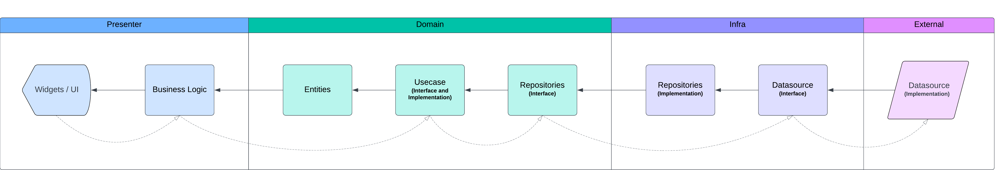

# To-Do with Clean Arch

This is a to-do app example with a clean architecture.

## Architecture

The applied architecture is a clean architecture that works with layers, where the external layers know the internal layers, but the internals don't know the externals.

## Good Practices and Patterns

This project applies good programming practices and familiar patterns, such as SOLID principles, repository pattern, etc.

## Bonus 

If you want to see the same project but with the Micro Front-Ends pattern applied, you can find it here:

- [To-Do with Clean Arch and Micro Front Ends](https://github.com/mathsilva-dev/todo_mfe_monorepo)
